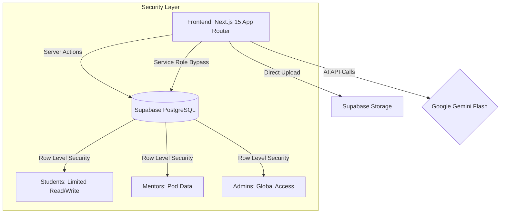
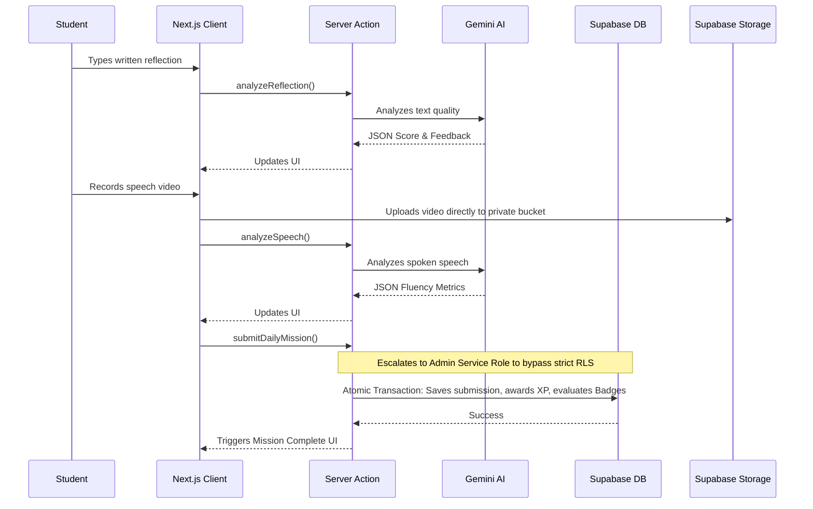

<div align="center">
  
  <br/>
  <h1>SKYLD Word Vault™</h1>
  <p><strong>A Premium AI-Powered EdTech Modular Monolith</strong></p>
  <p>Building the future of vocabulary mastery through structured reflection, speech practice, social engagement, and real-time AI feedback.</p>
</div>

<hr />

## 🌟 Executive Summary

**SKYLD Word Vault™** is a highly secure, scalable, and premium web application designed to bridge the gap between passive vocabulary learning and active communication. By utilizing **Google Gemini AI** and **Supabase**, this platform creates a rich, interactive daily learning loop for students, while providing Mentors and Administrators with powerful oversight tools.

Built as a **Modular Monolith** using **Next.js 16 (App Router)**, it balances the rapid iteration speed of a monolith with the organizational clarity needed for enterprise scaling. It has been built out in four distinct phases, resulting in a production-ready, ₹0-cost scalable architecture.

---

## 🏗️ Architecture Workflow

The system is built on a robust, serverless-first architecture optimized for performance, security, and scalability.

### System Architecture


### End-to-End Data Flow (Daily Mission)


### 1. The Stack
- **Frontend & API:** Next.js 15 (React 18), Tailwind CSS, Framer Motion, Shadcn UI
- **Backend & Database:** Supabase (PostgreSQL), Supabase Auth, Supabase Storage
- **AI Engine:** Google Gemini (1.5 Flash) via `@google/generative-ai` with **Zod** schema validation for deterministic structured outputs.

### 2. Data Flow & Security (RLS)
The application employs a strict **Role-Based Access Control (RBAC)** model defined at the database layer using Postgres Row Level Security (RLS).
* **Students** can only read their assigned Word Cards, communicate with their own Pod, and write to their own Submissions.
* **Mentors** are assigned to "Pods" (cohorts) and can only query data for students within their specific Pod. Video reviews use **dynamic, short-lived Signed URLs**, ensuring media cannot be leaked publicly.
* **Admins** have global read/write access to manage users, generate secure invite codes, post global announcements, and author content.

---

## ✨ Feature Breakdown (Phases 1-4)

### 🏫 Phase 1: Social Hierarchy (Batches, Units, Pods)
* **Batches & Units**: Students are grouped into grand "Batches" and smaller "Units".
* **Pods**: Tight-knit micro-cohorts where students collaborate. Mentors are assigned directly to Pods.
* **Buddy System**: Intelligent matchmaking for daily accountability within a Pod.

### 🎓 Phase 2 & 3: For Students (The Vault & Social Loop)
* **The 16-Field Word Card**: Expanded vocabulary structure including IPA pronunciation, synonyms, antonyms, business/life examples, common mistakes, and communication challenges.
* **The Daily Ritual**: A robust, transaction-safe daily learning flow (`Discover -> Practice Quiz -> Apply -> Reflect -> Speak -> Result`).
* **Ritual Reviews (Peer Feedback)**: Students review each other's submissions asynchronously via secure, short-lived video URLs.
* **Gamification Engine**: Real-time XP tracking, Daily Ritual points, Badges, and Streaks.
* **Championships & Leaderboards**: Weekly themes and pod-based competitions culminating in a Grand Championship. Standings are tracked securely via PostgreSQL Views.
* **In-App Notifications**: Real-time bell notifications tracking system events, review assignments, and championship updates.

### 👨‍🏫 For Mentors (The Dashboard)
* **Pod Management**: View activity statuses, streaks, and engagement metrics for a cohort of students.
* **Deep-Dive Student Profiles**: Access a specialized mentor view of a student's historic archive, including exact AI scores and feedback.
* **Master Evaluations**: Mentors can override or provide authoritative evaluations during Championship Weeks.

### 👑 Phase 4: Scaling & Analytics Audit (Current Phase)
* **Production-Ready Analytics**: Deeply optimized PostgreSQL Views (`student_engagement_stats`, `vocabulary_performance_stats`, `pod_standings`, `system_health_metrics`) providing real-time metrics on engagement and health.
* **AI Background Jobs & Cron**: A robust background job queue (`ai_jobs`) processing Gemini AI evaluations asynchronously. Processed via Vercel Cron jobs (`/api/cron/process-ai`) to ensure no timeouts during heavy submissions.
* **Dynamic Analytics**: Removed fragile legacy columns (e.g. `current_streak`) in favor of dynamic, on-the-fly SQL window functions calculating active streaks securely.
* **System Hardening**: Client-side component optimization, React Strict Mode hydration fixes for real-time channels (e.g. Supabase NotificationBell), and resilient Server Actions.
* **Global Directory**: Real-time visibility into all platform users, roles, and pod assignments directly in the Admin CMS.

---

## 🚀 How to Run Locally

Get the project running on your local machine in just a few minutes.

### 1. Prerequisites
- Node.js 18+
- npm or yarn
- A [Supabase](https://supabase.com/) account
- A [Google Gemini](https://ai.google.dev/) API Key

### 2. Clone & Install
```bash
git clone https://github.com/srikareddz2105/SKYLD-project.git
cd skyld-word-vault
npm install
```

### 3. Environment Configuration
Create a `.env.local` file in the root directory:
```env
NEXT_PUBLIC_SUPABASE_URL=your_supabase_project_url
NEXT_PUBLIC_SUPABASE_ANON_KEY=your_supabase_anon_key
SUPABASE_SERVICE_ROLE_KEY=your_supabase_service_role_key
GEMINI_API_KEY=your_gemini_api_key
```

### 4. Database Setup (Supabase)
Run the Supabase CLI to apply the exact production schema, security rules, and seed data:
```bash
npx supabase link --project-ref your_project_ref
npx supabase db push
```

### 5. Seed Mock Data
Populate your local environment with dummy users, word cards, and test submissions:
```bash
npx ts-node -O '{"module":"commonjs"}' supabase/seed.ts
```
*(Note: Seed script contains default local accounts and must NOT be run in production! Default local password: `skyld_local_dev_123!`)*

### 6. Start the Server
```bash
npm run dev
```
Navigate to `http://localhost:3000` to view the application!

---

## 🌐 Production Deployment Guide (For Managers)

Deploying the SKYLD Word Vault™ to production is seamless and highly secure, utilizing Vercel's edge network and Supabase's managed Postgres.

### Step 1: Prepare Supabase (Backend)
1. Create a new production project in Supabase.
2. Navigate to the SQL Editor and run the entirety of `supabase/schema.sql` to instantiate the production tables and RLS rules.
3. Under **Authentication > URL Configuration**, add your intended production domain (e.g., `https://skyld.vercel.app`) as the Site URL and allowed callback URL.

### Step 2: Prepare Vercel (Frontend)
1. Log into [Vercel](https://vercel.com) and click **Add New Project**.
2. Import this GitHub repository.
3. In the **Environment Variables** section, add the following securely:
   - `NEXT_PUBLIC_SUPABASE_URL`: (From Supabase Project Settings > API)
   - `NEXT_PUBLIC_SUPABASE_ANON_KEY`: (From Supabase Project Settings > API)
   - `SUPABASE_SERVICE_ROLE_KEY`: (From Supabase Project Settings > API - **CRITICAL:** Do NOT prefix this with `NEXT_PUBLIC_` as it bypasses RLS for admin tasks).
   - `GEMINI_API_KEY`: Your Google AI Studio API key.

### Step 3: Deploy
1. Click **Deploy**. Vercel will automatically run the Next.js production build (`npm run build`).
2. Once complete, your application is live on the edge network.
3. Access the platform using the provided Vercel domain. To create your first Admin, sign up securely through the app using a strong password, then manually change your role to `admin` in the Supabase `users` table via the Supabase Dashboard. After this, you can use the Admin Dashboard to generate secure invites for others.

---

<div align="center">
  <p>Built with ❤️ for the future of education.</p>
</div>
 
